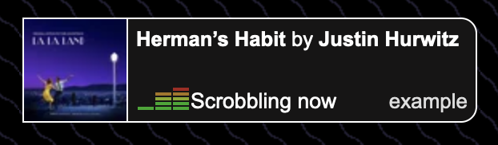

# lastfm-status

Simple api for showing currently scrobbling song on website



## Embedding it into your site

```html
<iframe
    src="https://lastfm.catnip.ee/status?username=YourLastfmUsername"
></iframe>
```


## Dependencies
- golang

## Running manually
```
git clone https://github.com/BatteredBunny/lastfm-status
cd lastfm-status
go run . --port 8080
```

## Running with nix
```
nix run github:BatteredBunny/lastfm-status
```

## Running as service on nixos
```nix
# flake.nix
inputs = {
    lastfm-status.url = "github:BatteredBunny/lastfm-status";
};
```

```nix
# configuration.nix
imports = [
    inputs.lastfm-status.nixosModules.${builtins.currentSystem}.default
];

services.lastfm-status = {
    enable = true;
    port = 8080;

    # Optional parameters
    package = inputs.lastfm-status.packages.${builtins.currentSystem}.default;
    cacheLength = "1m";
    enableRatelimiting = true;
};
```